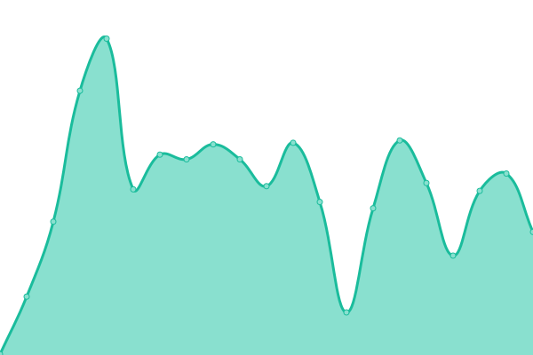

# [📈 Live Status](https://reAlpha.github.io/naamche/claire): <!--live status--> **🟩 All systems operational**

This repository contains the open-source uptime monitor and status page for [realpha](https://reAlpha.github.io/naamche/claire), powered by [Upptime](https://github.com/upptime/upptime).

With [Upptime](https://upptime.js.org), you can get your own unlimited and free uptime monitor and status page, powered entirely by a GitHub repository. We use [Issues](https://github.com/reAlpha/naamche/claire/issues) as incident reports, [Actions](https://github.com/reAlpha/naamche/claire/actions) as uptime monitors, and [Pages](https://reAlpha.github.io/naamche/claire) for the status page.

<!--start: status pages-->
<!-- This summary is generated by Upptime (https://github.com/upptime/upptime) -->
<!-- Do not edit this manually, your changes will be overwritten -->
<!-- prettier-ignore -->
| URL | Status | History | Response Time | Uptime |
| --- | ------ | ------- | ------------- | ------ |
|  [Claire FE](https://www.realpha.com/) | 🟩 Up | [claire-fe.yml](https://github.com/aakritsubedi/uptime/commits/HEAD/history/claire-fe.yml) | 

 228ms
     
 | 

<a href="https://aakritsubedi.github.io/uptime/history/claire-fe">99.64%</a>
    

|  [Claire API](https://backend-prod.realpha.com/aire-backend/api/health/) | 🟩 Up | [claire-api.yml](https://github.com/aakritsubedi/uptime/commits/HEAD/history/claire-api.yml) | 

 718ms
     
 | 

<a href="https://aakritsubedi.github.io/uptime/history/claire-api">99.35%</a>
    

|  [Data Repo](https://data.prod.realpha.com/health/) | 🟩 Up | [data-repo.yml](https://github.com/aakritsubedi/uptime/commits/HEAD/history/data-repo.yml) | 

 254ms
     
 | 

<a href="https://aakritsubedi.github.io/uptime/history/data-repo">99.35%</a>
    

|  [Claire FE (Staging)](https://www.realpha.com/) | 🟩 Up | [claire-fe-staging.yml](https://github.com/aakritsubedi/uptime/commits/HEAD/history/claire-fe-staging.yml) | 

 22ms
     
 | 

<a href="https://aakritsubedi.github.io/uptime/history/claire-fe-staging">99.64%</a>
    

|  [Claire API (Staging)](https://backend-prod.realpha.com/aire-backend/api/health/) | 🟩 Up | [claire-api-staging.yml](https://github.com/aakritsubedi/uptime/commits/HEAD/history/claire-api-staging.yml) | 

 34ms
     
 | 

<a href="https://aakritsubedi.github.io/uptime/history/claire-api-staging">99.35%</a>
    

|  [Data Repo (Staging)](https://data.staging.realpha.com/health/) | 🟩 Up | [data-repo-staging.yml](https://github.com/aakritsubedi/uptime/commits/HEAD/history/data-repo-staging.yml) | 

 3237ms
     
 | 

<a href="https://aakritsubedi.github.io/uptime/history/data-repo-staging">98.86%</a>
    

<!--end: status pages-->

[**Visit our status website →**](https://reAlpha.github.io/naamche/claire)

## 📄 License

- Powered by: [Upptime](https://github.com/upptime/upptime)
- Code: [MIT](./LICENSE) © [Anand Chowdhary](https://anandchowdhary.com), supported by [Pabio](https://pabio.com)
- Data in the `./history` directory: [Open Database License](https://opendatacommons.org/licenses/odbl/1-0/)
